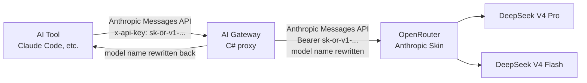

# AI Gateway

[](https://dotnet.microsoft.com/)
[](LICENSE)

A lightweight reverse proxy that lets you use non-Anthropic models with tools hard-coded to the Anthropic Messages API. It presents a Claude-compatible model list, rewrites model names in-flight, and forwards requests to OpenRouter's Anthropic-compatible API.

**Why?** Some AI tools (e.g. Claude Code) filter available models to Anthropic's own list and won't let you pick anything else — even when the upstream provider speaks the same API format. This proxy sidesteps that limitation without touching the tool itself.

**Auto-mode classifier routing.** When using Claude Code with a model like DeepSeek V4 Pro, the auto-mode security classifier inherits the main model. If that model slows down or becomes unavailable, the classifier fails and auto-mode breaks. The proxy detects these classifier requests by their system-prompt signature and routes them to a faster, separate model (e.g. DeepSeek V4 Flash), keeping auto-mode responsive.

## How it works



1. **Model discovery** — `GET /v1/models` returns a Claude-flavored model list so the client tool sees models it trusts.
2. **Classifier detection** — Auto-mode security classifier requests are identified by their system-prompt signature and routed directly to the configured classifier route (`Classifier:Target` plus optional `Backend` and `ProxyServer`), bypassing ordinary model mapping entirely.
3. **Model rewriting** — `claude-sonnet-4-20250514` in the request body becomes `deepseek/deepseek-v4-pro` before it hits OpenRouter. The response model name is rewritten back so the client never notices.
4. **API key passthrough (BYOK)** — Both `x-api-key` (desktop) and `Authorization: Bearer` (CLI) headers are accepted. The key is forwarded as `Authorization: Bearer` upstream. You use your own OpenRouter key — no shared keys, no proxy-side auth.

Because OpenRouter's `/api` base already speaks the Anthropic Messages format natively, no protocol translation is needed. Only the model name changes.

## Model mapping

| Client sends | Upstream (OpenRouter) |
|---|---|
| `claude-haiku-4-20250514` | `deepseek/deepseek-v4-flash` |
| `claude-haiku-*` | `deepseek/deepseek-v4-flash` |
| `claude-sonnet-4-20250514` | `deepseek/deepseek-v4-pro` |
| `claude-opus-4-20250514` | `deepseek/deepseek-v4-pro` |
| `claude-*` (catch-all) | `deepseek/deepseek-v4-pro` |

Rules are prefix-matched in order — the `claude-haiku` rule must come before the `claude` catch-all. Mappings are defined in `appsettings.json` and can be customized without code changes, or changed at runtime via the [admin API](#runtime-model-mapping-admin-api) without restarting the gateway.

## Quick start

### Prerequisites

- [.NET 9 SDK](https://dotnet.microsoft.com/download/dotnet/9.0) (for local dev)
- An [OpenRouter API key](https://openrouter.ai/keys)

### Run locally

```bash
# Clone
git clone https://github.com/Shepherd0619/ai-gateway.git
cd ai-gateway

# Run (listens on http://0.0.0.0:4000)
dotnet run

# Or with a custom upstream
Upstream__BaseUrl=https://openrouter.ai/api dotnet run
```

### Docker

```bash
docker build -t ai-gateway .
docker run -p 4000:4000 ai-gateway
```

Pre-built images are published to [GitHub Container Registry](https://github.com/Shepherd0619/ai-gateway/pkgs/container/ai-gateway).

### Verify

```bash
# 1. Model discovery
curl http://localhost:4000/v1/models -H "x-api-key: sk-or-v1-YOUR_KEY"

# 2. Send a chat request
curl http://localhost:4000/v1/messages \
  -H "x-api-key: sk-or-v1-YOUR_KEY" \
  -H "anthropic-version: 2023-06-01" \
  -H "content-type: application/json" \
  -d '{"model":"claude-sonnet-4-20250514","max_tokens":50,"messages":[{"role":"user","content":"Hello"}]}'

# 3. Point your AI tool at the proxy
export ANTHROPIC_BASE_URL=http://localhost:4000
export ANTHROPIC_AUTH_TOKEN=sk-or-v1-YOUR_KEY
```

## Configuration

All settings live in `appsettings.json`.

| Section | Key | Default | Description |
|---|---|---|---|
| `ModelMapping` | `Rules` | — | Array of `{ "Prefix", "Target", "Backend", "ProxyServer" }` objects for model routing and rewriting |
| `Backends` | `<name>.BaseUrl` | `openrouter` / `https://openrouter.ai/api` | Named Anthropic-compatible upstream backends |
| `Upstream` | `BaseUrl` | `https://openrouter.ai/api` | Legacy fallback used when `Backends.openrouter` is not configured |
| `Classifier` | `Target`, `Backend`, `ProxyServer` | — | Dedicated route for auto-mode classifier requests; empty `Target` disables it |
| `ComplianceLog` | `Enabled` | `false` | Enable per-request JSON-line audit log |
| `ComplianceLog` | `Path` | `/var/log/ai-gateway/compliance.log` | Where to write the compliance log |
| `Admin` | `ApiKey` | — | API key protecting the admin API (unset disables it) |
| `Admin` | `RuntimeConfigPath` | `mappings-runtime.json` | Where runtime mapping overrides are persisted; classifier overrides are stored beside it as `classifier-runtime.json` |

The admin UI harden/export action includes both `ModelMapping` and the standalone `Classifier` route. Classifier routing is not evaluated through `ModelMapping` at runtime.

The classifier admin endpoints are `GET/PUT/DELETE /admin/classifier`. An empty `Target` disables the classifier-specific route and returns matching requests to ordinary model mapping.

### Classifier configuration breaking change

Classifier routing now uses the same route fields as model mappings:

```json
"Classifier": {
  "Target": "deepseek/deepseek-v4-flash",
  "Backend": "openrouter",
  "ProxyServer": null
}
```

`Classifier:TargetModel` is no longer supported. Classifier runtime overrides in `classifier-runtime.json` and `PUT /admin/classifier` use `Target`, `Backend`, and `ProxyServer`; existing `TargetModel` values must be migrated manually.


## Runtime model mapping (admin API)
| `Kestrel` | `Endpoints.Http.Url` | `http://0.0.0.0:4000` | Listen address and port |

All settings can also be overridden with environment variables (e.g. `Upstream__BaseUrl`).

### Custom model mapping example

```json
{
  "ModelMapping": {
    "Rules": [
      { "Prefix": "claude-haiku",  "Target": "openai/gpt-4o-mini" },
      { "Prefix": "claude-sonnet", "Target": "openai/gpt-4o" },
      { "Prefix": "claude",        "Target": "deepseek/deepseek-v4-pro" }
    ]
  }
}
```

## Runtime model mapping (admin API)

Model mappings can be changed at runtime without restarting the gateway. Changes take effect immediately and persist to `mappings-runtime.json`, which survives container redeploys when mounted as a volume.

Enable the admin API by setting an API key:

```json
{
  "Admin": {
    "ApiKey": "sk-admin-your-secret",
    "RuntimeConfigPath": "mappings-runtime.json"
  }
}
```

Or via environment variable `Admin__ApiKey`. When no key is set, the admin API is disabled and returns `404`.

All admin endpoints require the `x-admin-key` header:

| Method | Path | Description |
|---|---|---|
| `GET` | `/admin/mappings` | List all effective rules (merged view) |
| `GET` | `/admin/mappings/{prefix}` | Get a single rule |
| `PUT` | `/admin/mappings` | Replace all runtime rules |
| `PATCH` | `/admin/mappings/{prefix}` | Upsert a single rule |
| `DELETE` | `/admin/mappings/{prefix}` | Remove a runtime override (fall back to default) |

```bash
# List rules
curl http://localhost:4000/admin/mappings -H "x-admin-key: sk-admin-your-secret"

# Change the `claude` catch-all to a different model
curl -X PATCH http://localhost:4000/admin/mappings/claude \
  -H "x-admin-key: sk-admin-your-secret" \
  -H "content-type: application/json" \
  -d '{"target":"openai/gpt-5","proxyServer":null}'

# Remove the override (fall back to appsettings.json default)
curl -X DELETE http://localhost:4000/admin/mappings/claude \
  -H "x-admin-key: sk-admin-your-secret"
```

**Persistence in Docker:** the runtime config path must be a writable volume mount, e.g. `Admin__RuntimeConfigPath=/data/mappings-runtime.json` with `-v ./data:/data`. The distroless container's `/app` directory is not guaranteed writable.

## Health check

```
GET /health → {"status":"healthy","upstream":"https://openrouter.ai/api","latency_ms":42}
```

Tests connectivity to the configured upstream with a 5-second timeout. Returns `503` when the upstream is unreachable.

## Project structure

```
ai-gateway/
├── Program.cs                      # App entry point, DI, middleware pipeline
├── Proxy/
│   ├── ProxyHandler.cs             # Core proxy logic: auth, classifier detection, model rewrite, forwarding
│   ├── ModelMapper.cs              # Prefix-based model name mapping
│   └── ClassifierDetector.cs       # Detects auto-mode classifier requests by system-prompt signature
├── Admin/
│   └── AdminEndpoints.cs           # /admin/mappings CRUD + x-admin-key auth
├── Configuration/
│   ├── MappingRule.cs              # Record: Prefix → Target
│   ├── ModelMappingOptions.cs      # Record: list of MappingRules
│   ├── AdminOptions.cs             # Record: admin API key + runtime config path
│   ├── RuntimeMappingStore.cs      # Merged base + runtime rules, file persistence
│   └── ComplianceLogOptions.cs     # Record: log toggles
├── Discovery/
│   └── ModelDiscoveryEndpoints.cs  # GET /v1/models — spoofed Claude model list
├── Health/
│   └── HealthEndpoints.cs          # GET /health — upstream connectivity check
├── Compliance/
│   ├── ComplianceEntry.cs          # Record: audit log row
│   └── ComplianceLogWriter.cs      # BackgroundService: Channel→file JSON-lines log
├── appsettings.json                # Runtime configuration
├── Dockerfile                      # Multi-stage build (SDK → chiseled runtime)
└── ai-gateway.csproj               # .NET 9 Minimal API, no third-party dependencies
```

## Tech stack

| Layer | Choice |
|---|---|
| Runtime | .NET 9 Minimal API |
| Container | `mcr.microsoft.com/dotnet/runtime-deps:9.0-noble-chiseled` |
| Dependencies | **None** beyond the .NET BCL |
| Docker image | ~35 MB compressed |
| Memory (idle) | ~50-80 MB |

## Limitations

- **No authentication on the proxy itself.** Deploy it on a trusted network (VPN / tailnet) or put a reverse proxy with auth in front of it.
- **OpenRouter-specific.** The proxy assumes an Anthropic-skin compatible upstream. It may work with other providers that speak the same format but hasn't been tested.
- **Prompt injection protection.** OpenRouter's prompt injection guard may block classifier requests as false positives. If auto-mode fails with a `403` and `"prompt injection patterns detected"`, disable this protection in your [OpenRouter account settings](https://openrouter.ai/settings) under "Prompt Security".

## License

BSD 3-Clause.